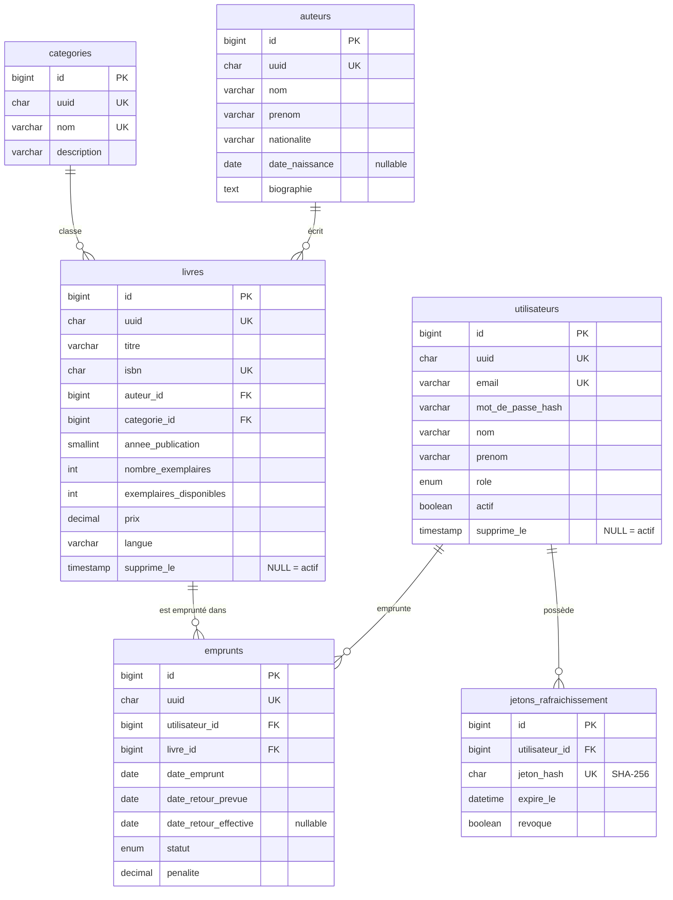

# DATABASE.md — Le modèle de données MariaDB, en détail

Ce document décrit **exhaustivement** la base `bibliotheque` : ses tables et contraintes, ses
index, ses relations, ses vues, ses fonctions, ses procédures stockées, ses triggers, ses events,
sa gestion des transactions et des erreurs SQL. Chaque élément est **expliqué et justifié**.

Tout le SQL vit dans `sql/`, découpé par nature et **numéroté** pour garantir l'ordre d'exécution
au premier démarrage Docker (`/docker-entrypoint-initdb.d/`) :

| Fichier                              | Contenu                                                        |
|--------------------------------------|---------------------------------------------------------------|
| `sql/schema/00_creation_manuelle.sql`| Création « à la main » (base + utilisateurs) — **non** joué par Docker |
| `sql/schema/01_privileges.sql`       | Durcissement des droits (moindre privilège) + event scheduler |
| `sql/schema/02_tables.sql`           | Toutes les tables, contraintes et index « en ligne »          |
| `sql/schema/03_index.sql`            | Index additionnels (composé, `FULLTEXT`)                      |
| `sql/functions/04_fonctions.sql`     | Fonctions stockées                                            |
| `sql/views/05_vues.sql`              | Vues                                                          |
| `sql/procedures/06_procedures.sql`   | Procédures stockées (`IN`/`OUT`/`INOUT`, transactions)       |
| `sql/triggers/07_triggers.sql`       | Triggers                                                      |
| `sql/events/08_events.sql`           | Events planifiés                                             |
| `sql/data/09_seed.sql`               | Jeu de données de démonstration                              |
| `sql/migrations/`                    | Exemples de migrations versionnées                           |

**Conventions appliquées partout :**

- Clé primaire technique `id` en `BIGINT UNSIGNED AUTO_INCREMENT`, **jamais exposée** à l'API.
- Identifiant public `uuid` en `CHAR(36)`, `UNIQUE`, exposé à la place de l'`id` (anti-IDOR).
- Horodatage `cree_le` / `modifie_le` automatiques (`DEFAULT CURRENT_TIMESTAMP` / `ON UPDATE`).
- Moteur **InnoDB** (transactions, clés étrangères), charset **utf8mb4**, collation
  **utf8mb4_unicode_ci** (imposée à tous les niveaux, voir `docker/mariadb/conf.d/charset.cnf`).

## Table des matières

- [Diagramme des relations](#diagramme-des-relations)
- [Tables](#tables)
- [Index](#index)
- [Vues](#vues)
- [Fonctions stockées](#fonctions-stockées)
- [Procédures stockées](#procédures-stockées)
- [Triggers](#triggers)
- [Events planifiés](#events-planifiés)
- [Transactions](#transactions)
- [Gestion des erreurs SQL](#gestion-des-erreurs-sql)
- [Privilèges et sécurité](#privilèges-et-sécurité)

---

## Diagramme des relations

### Vue Mermaid (rendu automatique sur GitHub/GitLab)



### Vue ASCII (relations principales)

```
   auteurs (1) ────< (N) livres (N) >──── (1) categories
                          │
                          │ (1)
                          ^
                          │ (N)
 utilisateurs (1) ───────< (N) emprunts

 utilisateurs (1) ───────< (N) jetons_rafraichissement

 Tables techniques (sans FK, alimentées par triggers/events) :
   journal_audit · emprunts_archive · statistiques_quotidiennes
```

Lecture : un **auteur** écrit plusieurs **livres** ; une **catégorie** classe plusieurs livres ;
un **utilisateur** réalise plusieurs **emprunts**, chacun portant sur un **livre**.

---

## Tables

Neuf tables : cinq « métier » (`utilisateurs`, `categories`, `auteurs`, `livres`, `emprunts`),
une de sécurité (`jetons_rafraichissement`) et trois **techniques** alimentées automatiquement
(`journal_audit`, `emprunts_archive`, `statistiques_quotidiennes`).

### `utilisateurs`

Comptes applicatifs : authentification, rôles, suppression logique.

| Colonne             | Type                                         | Contraintes / Défaut                        |
|---------------------|----------------------------------------------|---------------------------------------------|
| `id`                | `BIGINT UNSIGNED`                            | **PK**, `AUTO_INCREMENT`                     |
| `uuid`              | `CHAR(36)`                                   | `NOT NULL`, **UNIQUE** (`uq_utilisateurs_uuid`) |
| `email`             | `VARCHAR(254)`                               | `NOT NULL`, **UNIQUE**, `CHECK` format e-mail |
| `mot_de_passe_hash` | `VARCHAR(255)`                               | `NOT NULL` — haché **bcrypt** (jamais en clair) |
| `nom`               | `VARCHAR(100)`                               | `NOT NULL`                                   |
| `prenom`            | `VARCHAR(100)`                               | `NOT NULL`                                   |
| `role`              | `ENUM('admin','bibliothecaire','membre')`    | `NOT NULL`, `DEFAULT 'membre'`               |
| `actif`             | `BOOLEAN`                                     | `NOT NULL`, `DEFAULT TRUE`                    |
| `cree_le`           | `TIMESTAMP`                                   | `DEFAULT CURRENT_TIMESTAMP`                   |
| `modifie_le`        | `TIMESTAMP`                                   | `DEFAULT CURRENT_TIMESTAMP ON UPDATE CURRENT_TIMESTAMP` |
| `supprime_le`       | `TIMESTAMP NULL`                              | `NULL` = actif ; non `NULL` = supprimé (logique) |

- **`CHECK (email LIKE '_%@_%.__%')`** : filet de sécurité sur la forme de l'e-mail (la validation
  fine est faite côté Go ; c'est une **défense en profondeur**).
- **`ENUM`** pour `role` : liste fermée, la base refuse toute autre valeur.
- **Index** : `idx_utilisateurs_role`, `idx_utilisateurs_supprime_le`.

### `categories`

| Colonne       | Type            | Contraintes / Défaut                      |
|---------------|-----------------|-------------------------------------------|
| `id`          | `BIGINT UNSIGNED` | **PK**, `AUTO_INCREMENT`                |
| `uuid`        | `CHAR(36)`      | `NOT NULL`, **UNIQUE**                     |
| `nom`         | `VARCHAR(100)`  | `NOT NULL`, **UNIQUE** (`uq_categories_nom`) |
| `description` | `VARCHAR(500)`  | `NOT NULL`, `DEFAULT ''`                   |
| `cree_le`     | `TIMESTAMP`     | `DEFAULT CURRENT_TIMESTAMP`                |
| `modifie_le`  | `TIMESTAMP`     | `… ON UPDATE CURRENT_TIMESTAMP`           |

Le **nom** est unique : impossible d'avoir deux fois « Roman ».

### `auteurs`

| Colonne          | Type            | Contraintes / Défaut                        |
|------------------|-----------------|---------------------------------------------|
| `id`             | `BIGINT UNSIGNED` | **PK**, `AUTO_INCREMENT`                  |
| `uuid`           | `CHAR(36)`      | `NOT NULL`, **UNIQUE**                       |
| `nom`            | `VARCHAR(100)`  | `NOT NULL`                                   |
| `prenom`         | `VARCHAR(100)`  | `NOT NULL`, `DEFAULT ''`                     |
| `nationalite`    | `VARCHAR(100)`  | `NOT NULL`, `DEFAULT ''`                     |
| `date_naissance` | `DATE NULL`     | `DEFAULT NULL` (peut être inconnue)         |
| `biographie`     | `TEXT NULL`     |                                             |
| `cree_le`        | `TIMESTAMP`     | `DEFAULT CURRENT_TIMESTAMP`                  |
| `modifie_le`     | `TIMESTAMP`     | `… ON UPDATE CURRENT_TIMESTAMP`            |

- **Index composé** `idx_auteurs_nom_prenom (nom, prenom)` : accélère la recherche/tri par nom
  complet (voir [Index](#index) pour l'importance de l'**ordre** des colonnes).

### `livres`

Catalogue et gestion du stock ; porte les clés étrangères vers `auteurs` et `categories`.

| Colonne                  | Type                                  | Contraintes / Défaut                    |
|--------------------------|---------------------------------------|-----------------------------------------|
| `id`                     | `BIGINT UNSIGNED`                     | **PK**, `AUTO_INCREMENT`                 |
| `uuid`                   | `CHAR(36)`                            | `NOT NULL`, **UNIQUE**                   |
| `titre`                  | `VARCHAR(255)`                        | `NOT NULL`                               |
| `isbn`                   | `CHAR(13)`                            | `NOT NULL`, **UNIQUE** (13 chiffres, canonique) |
| `auteur_id`              | `BIGINT UNSIGNED`                     | `NOT NULL`, **FK** → `auteurs(id)`      |
| `categorie_id`           | `BIGINT UNSIGNED`                     | `NOT NULL`, **FK** → `categories(id)`   |
| `annee_publication`      | `SMALLINT UNSIGNED`                   | `NOT NULL`, `CHECK BETWEEN 1400 AND 2200` |
| `nombre_exemplaires`     | `INT UNSIGNED`                        | `NOT NULL`, `DEFAULT 1`                   |
| `exemplaires_disponibles`| `INT UNSIGNED`                        | `NOT NULL`, `DEFAULT 1`                   |
| `resume`                 | `TEXT NULL`                           |                                          |
| `prix`                   | `DECIMAL(8,2)`                        | `NOT NULL`, `DEFAULT 0.00`, `CHECK >= 0` |
| `langue`                 | `VARCHAR(50)`                         | `NOT NULL`, `DEFAULT 'français'`         |
| `cree_le` / `modifie_le` | `TIMESTAMP`                           | automatiques                             |
| `supprime_le`            | `TIMESTAMP NULL`                      | suppression logique                      |

**Contraintes clés :**

- `CONSTRAINT chk_livres_stock CHECK (exemplaires_disponibles <= nombre_exemplaires)` :
  invariant de stock garanti par la base (**défense en profondeur** en plus de la logique Go).
- `CONSTRAINT chk_livres_annee CHECK (annee_publication BETWEEN 1400 AND 2200)`.
- `CONSTRAINT chk_livres_prix CHECK (prix >= 0)`.
- **FK** `fk_livres_auteur` et `fk_livres_categorie` : `ON DELETE RESTRICT ON UPDATE CASCADE`.
  `RESTRICT` empêche de supprimer un auteur/une catégorie encore référencé (pas de livre orphelin).
- Le prix utilise `DECIMAL(8,2)` (montant **exact**, pas de flottant) — contrairement au type Go
  `float64` du modèle, choisi par simplicité (voir le commentaire dans `internal/models/livre.go`).

**Index** : `idx_livres_titre`, `idx_livres_auteur`, `idx_livres_categorie`, `idx_livres_dispo`
(+ index additionnels dans `03_index.sql`).

### `emprunts`

Cœur métier : le prêt d'un livre à un utilisateur.

| Colonne                 | Type                                    | Contraintes / Défaut                          |
|-------------------------|-----------------------------------------|-----------------------------------------------|
| `id`                    | `BIGINT UNSIGNED`                       | **PK**, `AUTO_INCREMENT`                       |
| `uuid`                  | `CHAR(36)`                              | `NOT NULL`, **UNIQUE**                         |
| `utilisateur_id`        | `BIGINT UNSIGNED`                       | `NOT NULL`, **FK** → `utilisateurs(id)`       |
| `livre_id`              | `BIGINT UNSIGNED`                       | `NOT NULL`, **FK** → `livres(id)`             |
| `date_emprunt`          | `DATE`                                  | `NOT NULL`, `DEFAULT (CURRENT_DATE)`           |
| `date_retour_prevue`    | `DATE NULL`                             | `DEFAULT NULL` — **calculée** par trigger si absente (+14 j) |
| `date_retour_effective` | `DATE NULL`                             | `NULL` tant que non rendu                      |
| `statut`                | `ENUM('en_cours','rendu','en_retard')`  | `NOT NULL`, `DEFAULT 'en_cours'`               |
| `penalite`              | `DECIMAL(8,2)`                          | `NOT NULL`, `DEFAULT 0.00`, `CHECK >= 0`       |
| `cree_le` / `modifie_le`| `TIMESTAMP`                             | automatiques                                   |

**Contraintes clés :**

- `CONSTRAINT chk_emprunts_dates CHECK (date_retour_prevue >= date_emprunt)`.
- `CONSTRAINT chk_emprunts_penalite CHECK (penalite >= 0)`.
- **FK** `fk_emprunts_utilisateur` : `ON DELETE CASCADE` (si un compte est supprimé
  physiquement, ses emprunts partent avec) ; `fk_emprunts_livre` : `ON DELETE RESTRICT` (on ne
  supprime pas un livre encore emprunté).

**Index** : `idx_emprunts_utilisateur`, `idx_emprunts_livre`, `idx_emprunts_statut`,
`idx_emprunts_retour_prevue`, et l'index **composé** `idx_emprunts_util_statut (utilisateur_id,
statut)` (requête fréquente « les emprunts actifs d'un membre »).

### `jetons_rafraichissement`

Refresh tokens permettant de renouveler un jeton d'accès JWT.

| Colonne          | Type              | Contraintes / Défaut                    |
|------------------|-------------------|-----------------------------------------|
| `id`             | `BIGINT UNSIGNED` | **PK**, `AUTO_INCREMENT`                 |
| `utilisateur_id` | `BIGINT UNSIGNED` | `NOT NULL`, **FK** → `utilisateurs(id)` `ON DELETE CASCADE` |
| `jeton_hash`     | `CHAR(64)`        | `NOT NULL`, **UNIQUE** — **SHA-256** du jeton (jamais le jeton en clair) |
| `expire_le`      | `DATETIME`        | `NOT NULL`                               |
| `revoque`        | `BOOLEAN`         | `NOT NULL`, `DEFAULT FALSE`              |
| `cree_le`        | `TIMESTAMP`       | `DEFAULT CURRENT_TIMESTAMP`              |

On stocke **uniquement le haché** : une fuite de la base ne révèle aucun refresh token
réutilisable. Même philosophie que pour les mots de passe.
**Index** : `idx_jetons_utilisateur`, `idx_jetons_expire`.

### `journal_audit` (technique)

Alimentée **uniquement par des triggers**. Trace qui a fait quoi, avant/après, sur les tables
sensibles.

| Colonne              | Type                                | Rôle                                       |
|----------------------|-------------------------------------|--------------------------------------------|
| `id`                 | `BIGINT UNSIGNED`                   | **PK**, `AUTO_INCREMENT`                    |
| `table_concernee`    | `VARCHAR(64)`                       | Table auditée                              |
| `operation`          | `ENUM('INSERT','UPDATE','DELETE')`  | Type d'opération                           |
| `cle_enregistrement` | `BIGINT UNSIGNED NULL`              | `id` de la ligne concernée                 |
| `anciennes_valeurs`  | `JSON NULL`                         | Photo AVANT (type JSON natif)              |
| `nouvelles_valeurs`  | `JSON NULL`                         | Photo APRÈS                                |
| `acteur_sql`         | `VARCHAR(128)`                      | `CURRENT_USER()` à l'origine de l'opération |
| `cree_le`            | `TIMESTAMP`                         | `DEFAULT CURRENT_TIMESTAMP`                 |

**Index** : `idx_audit_table`, `idx_audit_cree_le`, composé `idx_audit_table_op (table_concernee,
operation)`. Le mot de passe haché n'est **jamais** journalisé.

### `emprunts_archive` (technique)

Reçoit les emprunts anciens (rendus depuis plus d'un an), **déplacés par un event**. Pas de clés
étrangères : ce sont des données historiques figées. Colonnes identiques à `emprunts` (statut en
`VARCHAR(20)`) plus `archive_le TIMESTAMP DEFAULT CURRENT_TIMESTAMP`.

### `statistiques_quotidiennes` (technique)

Instantané journalier calculé par un event.

| Colonne                  | Type              | Rôle                                    |
|--------------------------|-------------------|-----------------------------------------|
| `id`                     | `BIGINT UNSIGNED` | **PK**, `AUTO_INCREMENT`                 |
| `date_statistique`       | `DATE`            | **UNIQUE** (`uq_stats_date`) : une ligne/jour |
| `nb_emprunts_actifs`     | `INT UNSIGNED`    | Emprunts `en_cours` + `en_retard`       |
| `nb_emprunts_en_retard`  | `INT UNSIGNED`    | Emprunts `en_retard`                    |
| `nb_livres`              | `INT UNSIGNED`    | Livres non supprimés                    |
| `nb_exemplaires_dispo`   | `INT UNSIGNED`    | Somme des exemplaires disponibles       |
| `nb_utilisateurs_actifs` | `INT UNSIGNED`    | Comptes actifs et non supprimés         |
| `cree_le`                | `TIMESTAMP`       | `DEFAULT CURRENT_TIMESTAMP`             |

La contrainte **`UNIQUE (date_statistique)`** permet à l'event de faire un « upsert »
(`INSERT … ON DUPLICATE KEY UPDATE`).

---

## Index

Un **index** est une structure (arbre B) qui permet de retrouver des lignes sans parcourir toute
la table. Il **accélère** les lectures (`WHERE`, `JOIN`, `ORDER BY`) mais **ralentit** légèrement
les écritures (il faut le maintenir) et occupe de l'espace. On indexe donc les colonnes réellement
filtrées/triées.

> **Vérifier qu'un index est utilisé** : préfixez la requête par `EXPLAIN` et regardez la colonne  
> `type` (évitez `ALL` = scan complet) et `key` (l'index choisi).  
> ```sql  
> EXPLAIN SELECT * FROM livres WHERE categorie_id = 5 ORDER BY titre;  
> ```

La plupart des index sont déclarés **dans** les tables (`02_tables.sql`, au plus près de la
colonne). Le fichier `03_index.sql` illustre trois notions avancées via `CREATE INDEX` :

| Index                          | Table    | Colonnes                          | Intérêt                                                    |
|--------------------------------|----------|-----------------------------------|------------------------------------------------------------|
| `idx_livres_categorie_titre`   | `livres` | `(categorie_id, titre)`           | **Composé** : `WHERE categorie_id = ? ORDER BY titre` filtre ET trie via le seul index |
| `idx_emprunts_statut_retour`   | `emprunts` | `(statut, date_retour_prevue)`  | Sert l'event de détection des retards (`statut='en_cours' AND date_retour_prevue < ?`) |
| `ft_livres_recherche`          | `livres` | `FULLTEXT (titre, resume)`        | Recherche plein-texte `MATCH … AGAINST` (option performante) |

**Ordre des colonnes d'un index composé.** Un index `(nom, prenom)` sert les requêtes filtrant sur
`nom` seul, ou sur `nom` **et** `prenom`, mais **pas** sur `prenom` seul. On place donc en tête la
colonne la plus sélective / la plus souvent filtrée.

**À propos du `FULLTEXT`.** `LIKE '%mot%'` avec un joker en tête **ne peut pas** utiliser un index
B-arbre (scan complet). Un index `FULLTEXT` permet `MATCH(titre, resume) AGAINST('aventure' IN
NATURAL LANGUAGE MODE)`, bien plus pertinent et rapide sur de gros volumes. Dans ce projet, la
recherche exposée par l'API reste volontairement en `LIKE` (plus simple à comprendre) ; l'index
est fourni pour expérimenter.

Pour supprimer un index : `DROP INDEX idx_livres_categorie_titre ON livres;`

---

## Vues

Une **vue** est une requête `SELECT` enregistrée sous un nom, interrogée comme une table. Elle ne
stocke rien : elle est recalculée à chaque interrogation. Avantages : masquer la complexité des
jointures, centraliser une règle de lecture, restreindre les colonnes exposées.

| Vue                        | Rôle                                                                              |
|----------------------------|-----------------------------------------------------------------------------------|
| `vue_livres_details`       | Catalogue « prêt à afficher » : livre + **nom de l'auteur** + **nom de la catégorie** + indicateur `disponible` (via `fn_est_disponible`). Exclut les livres supprimés (`supprime_le IS NULL`). |
| `vue_emprunts_en_cours`    | Tous les emprunts non rendus (`en_cours` ou `en_retard`) avec nom de l'emprunteur et titre du livre. |
| `vue_emprunts_en_retard`   | Emprunts en retard, avec **jours de retard** (`DATEDIFF`) et **pénalité courante** (`fn_calculer_penalite`). |
| `vue_statistiques_livres`  | Popularité par livre : nombre total d'emprunts et nombre d'emprunts actifs (`LEFT JOIN` pour inclure les livres jamais empruntés). |

> **Usage dans le code Go.** `LivreRepository` **lit** depuis `vue_livres_details` (jointures +  
> disponibilité déjà calculées) mais **écrit** dans la table `livres`. On interroge une vue  
> exactement comme une table : `SELECT … FROM vue_livres_details WHERE uuid = ?`.

---

## Fonctions stockées

Une fonction encapsule un **calcul réutilisable** directement dans le SQL (dans une vue, une
procédure, une requête ad hoc). Elle renvoie **une** valeur et s'utilise dans une expression.

| Fonction                                   | Paramètres                                    | Retour          | Rôle                                                        |
|--------------------------------------------|-----------------------------------------------|-----------------|-------------------------------------------------------------|
| `fn_est_disponible(p_livre_id)`            | `BIGINT UNSIGNED`                             | `BOOLEAN`       | `TRUE` si `exemplaires_disponibles > 0` (et livre non supprimé). `READS SQL DATA`. |
| `fn_calculer_penalite(p_date_prevue, p_date_effective)` | `DATE, DATE`                     | `DECIMAL(8,2)`  | **0,50 € par jour de retard**. Si `p_date_effective` est `NULL`, calcule « à aujourd'hui ». `NOT DETERMINISTIC`. |
| `fn_nb_emprunts_actifs(p_utilisateur_id)`  | `BIGINT UNSIGNED`                             | `INT`           | Nombre d'emprunts `en_cours` ou `en_retard` (sert au **quota**). `READS SQL DATA`. |

**Détails techniques** (expliqués dans `04_fonctions.sql`) :

- **`DELIMITER //`** : on change temporairement le délimiteur de fin d'instruction, car le corps
  d'une routine contient lui-même des `;`. On rétablit `;` après la définition.
- **`log_bin_trust_function_creators = 1`** : autorise la création de fonctions même quand la
  journalisation binaire est active.
- **Règle métier centralisée** : le tarif de pénalité (`0.50 €/jour`) est défini une seule fois,
  dans `fn_calculer_penalite`, et réutilisé par la vue des retards **et** par la transaction de
  retour côté Go — cohérence garantie.

---

## Procédures stockées

Contrairement à une fonction, une **procédure** peut **modifier** des données, gérer une
**transaction**, renvoyer **plusieurs** valeurs via des paramètres `OUT`, et s'appelle avec `CALL`.

### `pr_emprunter_livre` — emprunt atomique et sûr

```sql
CALL pr_emprunter_livre(
    IN  p_utilisateur_uuid CHAR(36),
    IN  p_livre_uuid       CHAR(36),
    IN  p_duree_jours      INT,
    OUT p_emprunt_uuid     CHAR(36),
    OUT p_code_resultat    INT,
    OUT p_message          VARCHAR(255)
);
```

**Déroulé** (le tout dans **une transaction**) : normalise la durée (bornée 1–90 j, défaut 14) →
`START TRANSACTION` → vérifie l'utilisateur (existant, actif) → **verrouille le livre**
(`SELECT … FOR UPDATE`) → vérifie disponibilité → vérifie **quota** (`fn_nb_emprunts_actifs` <
`v_quota_max = 5`) → insère l'emprunt et **décrémente** le stock → `COMMIT`. À la moindre anomalie :
`ROLLBACK` (aucune modification partielle).

**Codes de retour** (`p_code_resultat`), traduits en erreurs HTTP par le repository :

| Code | Signification                     | Erreur applicative renvoyée (statut) |
|:----:|-----------------------------------|--------------------------------------|
| `0`  | Succès                            | — (renvoie l'UUID de l'emprunt)      |
| `1`  | Livre introuvable                 | `NON_TROUVE` (404)                   |
| `2`  | Utilisateur introuvable/inactif   | `NON_TROUVE` (404)                   |
| `3`  | Aucun exemplaire disponible       | `CONFLIT` (409)                      |
| `4`  | Quota d'emprunts simultanés atteint | `CONFLIT` (409)                    |
| `99` | Erreur SQL inattendue (deadlock…) | `ERREUR_INTERNE` (500)               |

Un **`EXIT HANDLER FOR SQLEXCEPTION`** capture toute exception imprévue, fait `ROLLBACK` et
positionne le code `99` — jamais de message technique brut ne fuit.

> **Verrouillage et concurrence.** `SELECT … FOR UPDATE` verrouille la ligne du livre pour la  
> durée de la transaction. Deux emprunts concurrents du **dernier exemplaire** sont ainsi  
> **sérialisés** : le second attend, puis voit `exemplaires_disponibles = 0` et échoue proprement  
> (code `3`).

### `pr_statistiques_utilisateur` — plusieurs `OUT`

```sql
CALL pr_statistiques_utilisateur(
    IN  p_utilisateur_uuid CHAR(36),
    OUT p_nb_total         INT,
    OUT p_nb_en_cours      INT,
    OUT p_nb_en_retard     INT,
    OUT p_total_penalites  DECIMAL(10,2)
);
```

Illustre le retour de **plusieurs valeurs** par une procédure : une seule requête agrégée alimente
les quatre paramètres `OUT`. Exposée par `GET /api/v1/moi/statistiques`.

### `pr_ajuster_disponibilite` — paramètre `INOUT`

```sql
CALL pr_ajuster_disponibilite(
    INOUT p_disponibles INT,
    IN    p_delta       INT
);
```

Exemple minimal d'un paramètre **`INOUT`** (entrée **et** sortie, modifié « sur place ») : ajoute
`p_delta` au stock courant en interdisant de passer sous zéro.

```sql
SET @stock = 3;
CALL pr_ajuster_disponibilite(@stock, -1);  -- @stock vaut désormais 2
SELECT @stock;
```

> **Appel depuis Go.** Les paramètres `OUT` transitent par des **variables de session**  
> (`@emprunt_uuid`…), qui ne vivent que sur **une** connexion. Comme `*sql.DB` est un pool, le  
> repository **réserve une connexion** (`db.Conn`), exécute le `CALL` **puis** lit les `@variables`  
> sur la **même** connexion, avant de la libérer. Voir `internal/repository/emprunt_repository.go`.

---

## Triggers

Un **trigger** s'exécute **automatiquement** lors d'un `INSERT`, `UPDATE` ou `DELETE`, **avant**
(`BEFORE`) ou **après** (`AFTER`) l'opération.

- **`BEFORE`** : idéal pour **normaliser/valider** une donnée avant écriture (on peut modifier
  `NEW.*`, ou refuser avec `SIGNAL`).
- **`AFTER`** : idéal pour des **effets de bord** une fois l'écriture confirmée (on ne peut plus
  modifier `NEW.*`), typiquement écrire une ligne d'audit.

**Choix d'architecture** : les triggers **ne gèrent pas** le stock (décrément/incrément des
exemplaires) — cette logique vit dans la procédure d'emprunt et la transaction de retour, pour
éviter tout double comptage. Les triggers se limitent à : générer des UUID, normaliser des champs,
**valider** (`SIGNAL`) et **journaliser** (`journal_audit`).

| Trigger                             | Table          | Timing         | Rôle                                                             |
|-------------------------------------|----------------|----------------|-----------------------------------------------------------------|
| `trg_utilisateurs_avant_insert`     | `utilisateurs` | `BEFORE INSERT`| Génère l'UUID si absent ; met l'e-mail en minuscules et sans espaces (unicité fiable) |
| `trg_utilisateurs_apres_insert`     | `utilisateurs` | `AFTER INSERT` | Audite la création (sans le mot de passe)                       |
| `trg_utilisateurs_apres_update`     | `utilisateurs` | `AFTER UPDATE` | Audite la modification (photo avant/après, hors mot de passe)   |
| `trg_utilisateurs_apres_delete`     | `utilisateurs` | `AFTER DELETE` | Audite la suppression physique                                  |
| `trg_livres_avant_insert`           | `livres`       | `BEFORE INSERT`| Génère l'UUID ; **normalise l'ISBN** (retire tirets/espaces)    |
| `trg_livres_avant_update`           | `livres`       | `BEFORE UPDATE`| **Valide** (`SIGNAL`) : refuse `exemplaires_disponibles > nombre_exemplaires` ; renormalise l'ISBN |
| `trg_livres_apres_update`           | `livres`       | `AFTER UPDATE` | Audite les changements de titre/stock/prix                      |
| `trg_emprunts_avant_insert`         | `emprunts`     | `BEFORE INSERT`| Génère l'UUID ; **calcule `date_retour_prevue`** si absente (`date_emprunt + 14 j`) |
| `trg_emprunts_apres_insert`         | `emprunts`     | `AFTER INSERT` | Audite la création de l'emprunt                                 |
| `trg_emprunts_apres_update`         | `emprunts`     | `AFTER UPDATE` | Audite les changements de statut (ex. passage à « rendu »)      |
| `trg_emprunts_avant_delete`         | `emprunts`     | `BEFORE DELETE`| **Règle métier** (`SIGNAL`) : interdit de supprimer un emprunt encore actif |

**`SIGNAL SQLSTATE '45000'`** lève une erreur applicative avec un `MESSAGE_TEXT` **en français**,
destiné à l'utilisateur. Ces messages sont **exposables** tels quels au client (voir [Gestion des
erreurs SQL](#gestion-des-erreurs-sql)), contrairement aux autres erreurs SQL.

> Un trigger doit rester **léger** : une logique lourde ou des effets « invisibles » compliquent le  
> débogage. Chaque trigger est documenté dans `07_triggers.sql`.

---

## Events planifiés

Un **event** est une tâche SQL exécutée **automatiquement** selon une planification, directement
par MariaDB (l'équivalent d'un `cron`, intégré à la base). Il faut que **l'ordonnanceur** soit
actif : `SET GLOBAL event_scheduler = ON` (dans `01_privileges.sql`) **et** l'option serveur
`--event-scheduler=ON` (dans `docker-compose.yml`, pour la persistance).

`ON COMPLETION PRESERVE` conserve l'event après exécution (indispensable pour une tâche
récurrente). Les `STARTS` sont décalés de quelques heures pour ne pas se déclencher pendant
l'initialisation de la base.

| Event                                   | Planification        | Rôle                                                              |
|-----------------------------------------|----------------------|-------------------------------------------------------------------|
| `ev_marquer_emprunts_en_retard`         | **chaque jour**      | Passe en `en_retard` les emprunts `en_cours` dont l'échéance est dépassée. Alimente la vue des retards et le calcul des pénalités. |
| `ev_purger_jetons_expires`              | **chaque heure**     | Supprime les refresh tokens expirés ou révoqués (limite la taille de la table et la surface d'attaque). |
| `ev_archiver_emprunts_anciens`          | **chaque jour**      | Déplace vers `emprunts_archive` les emprunts rendus depuis plus d'un an (`INSERT` puis `DELETE`). Garde la table `emprunts` compacte. |
| `ev_calculer_statistiques_quotidiennes` | **chaque jour**      | Agrège les indicateurs du jour dans `statistiques_quotidiennes` (upsert via `ON DUPLICATE KEY UPDATE`). |
| `ev_nettoyer_journal_audit`             | **chaque semaine**   | Supprime les entrées du `journal_audit` de plus de **90 jours** (politique de rétention). |

**Inspecter / tester les events :**

```sql
SHOW VARIABLES LIKE 'event_scheduler';   -- doit valoir ON
SHOW EVENTS;                             -- liste les events et leur prochaine exécution
-- Pour tester sans attendre, on peut exécuter le corps de l'event à la main, par ex. :
UPDATE emprunts SET statut = 'en_retard'
 WHERE statut = 'en_cours' AND date_retour_prevue < CURRENT_DATE;
```

---

## Transactions

Une **transaction** regroupe plusieurs opérations en un tout **atomique** : soit **tout** réussit
(`COMMIT`), soit **rien** n'est modifié (`ROLLBACK`). Ce projet montre les **deux** manières de
faire, sur les deux moments clés d'un emprunt.

### 1. Transaction dans une **procédure stockée** — l'emprunt

`pr_emprunter_livre` (voir plus haut) ouvre `START TRANSACTION`, verrouille le livre, vérifie tout,
insère l'emprunt **et** décrémente le stock (deux tables), puis `COMMIT`. Un `EXIT HANDLER FOR
SQLEXCEPTION` garantit le `ROLLBACK` en cas d'imprévu. La logique transactionnelle vit **au plus
près des données**.

### 2. Transaction en **Go** — le retour de livre

`EmpruntRepository.Rendre` (dans `internal/repository/emprunt_repository.go`) illustre une
transaction pilotée côté application, via l'aide `database.EnTransaction` :

```
BEGIN
  1. SELECT … FOR UPDATE      -- verrouille la ligne d'emprunt (anti double-retour concurrent)
  2. vérifie que l'emprunt est encore actif (sinon 409 « déjà rendu »)
  3. SELECT fn_calculer_penalite(date_prevue, CURRENT_DATE)  -- pénalité éventuelle
  4. UPDATE emprunts  SET statut='rendu', date_retour_effective=CURRENT_DATE, penalite=?
  5. UPDATE livres    SET exemplaires_disponibles = exemplaires_disponibles + 1
COMMIT   (ROLLBACK automatique si l'une des étapes échoue, ou en cas de panique)
```

Les étapes 4 et 5 touchent **deux** tables : c'est le cas d'école de la transaction. L'aide
`EnTransaction` applique le motif « **rollback automatique** » :

- `fn` renvoie une erreur → `ROLLBACK` ;
- `fn` réussit → `COMMIT` ;
- `fn` **panique** → `ROLLBACK` puis la panique est relancée (jamais de transaction « pendante »).

Le `context.Context` est propagé à `BeginTx` : si la requête HTTP est abandonnée (timeout, client
déconnecté), la transaction est annulée.

---

## Gestion des erreurs SQL

Les repositories **traduisent** les codes d'erreur MariaDB en erreurs métier (`apperreur`) pour
renvoyer un statut HTTP clair, **sans jamais** exposer de détail technique. Le mapping vit dans
`internal/database/erreurs.go`.

| Code MariaDB | Nom                     | Situation typique                                  | Traduction applicative                                   |
|:------------:|-------------------------|----------------------------------------------------|----------------------------------------------------------|
| `1062`       | `ER_DUP_ENTRY`          | Violation d'une contrainte **UNIQUE** (e-mail, ISBN, nom de catégorie) | `CONFLIT` (409) — « … existe déjà »            |
| `1452`       | `ER_NO_REFERENCED_ROW`  | **FK** vers une ligne inexistante                  | Traité en amont côté service (référence invalide, 422)   |
| `1451`       | `ER_ROW_IS_REFERENCED`  | Suppression **bloquée** par une FK (`RESTRICT`)    | `CONFLIT` (409) — « des livres y sont rattachés »        |
| `1644`       | `ER_SIGNAL_EXCEPTION`   | **`SIGNAL`** levé par un trigger/procédure         | `CONFLIT` (409) — **message français** exposé tel quel   |

Fonctions utilitaires :

- `EstErreurDoublon(err)` → détecte `1062`.
- `EstErreurCleEtrangere(err)` → détecte `1452` **ou** `1451`.
- `MessageSignal(err)` → extrait le `MESSAGE_TEXT` d'un `SIGNAL` (rédigé pour l'utilisateur, donc
  exposable).

**Exemple concret** (extrait de `LivreRepository.MettreAJour`) :

```go
if database.EstErreurDoublon(err) {
    return apperreur.Conflit("Un livre avec cet ISBN existe déjà.")
}
if message, ok := database.MessageSignal(err); ok {
    return apperreur.Conflit(message) // message du trigger, en français
}
return apperreur.Interne("mise à jour du livre").AvecCause(err) // cause journalisée, pas exposée
```

Ainsi, une erreur `sql.ErrNoRows` devient un **404** métier, un doublon un **409**, un `SIGNAL` un
**409** au message parlant, et **toute autre** erreur un **500** générique dont la cause n'est
visible que dans les logs serveur.

---

## Privilèges et sécurité

Le principe du **moindre privilège** est appliqué à l'utilisateur applicatif `app_bibliotheque`
(`01_privileges.sql`, joué au premier démarrage Docker) :

```sql
REVOKE ALL PRIVILEGES ON bibliotheque.* FROM 'app_bibliotheque'@'%';
GRANT SELECT, INSERT, UPDATE, DELETE, EXECUTE, SHOW VIEW ON bibliotheque.* TO 'app_bibliotheque'@'%';
```

L'application obtient **uniquement** :

- `SELECT/INSERT/UPDATE/DELETE` : le CRUD sur les tables et vues ;
- `EXECUTE` : l'appel des procédures et fonctions stockées ;
- `SHOW VIEW` : introspection des vues (débogage).

Elle **n'a pas** `DROP`, `ALTER`, `CREATE`, `GRANT`, `INDEX`, `REFERENCES`. Conséquence : même en
cas d'injection SQL réussie, l'attaquant ne pourrait ni détruire le schéma, ni s'octroyer de
nouveaux droits. C'est une **défense en profondeur** essentielle. L'application ne se connecte
**jamais** en `root` ; le fichier `00_creation_manuelle.sql` montre en prime comment créer un
compte **en lecture seule** (`lecteur_bibliotheque`) pour des besoins d'analyse.

Voir **[docs/SECURITE.md](docs/SECURITE.md)** pour l'analyse complète des menaces et protections.
